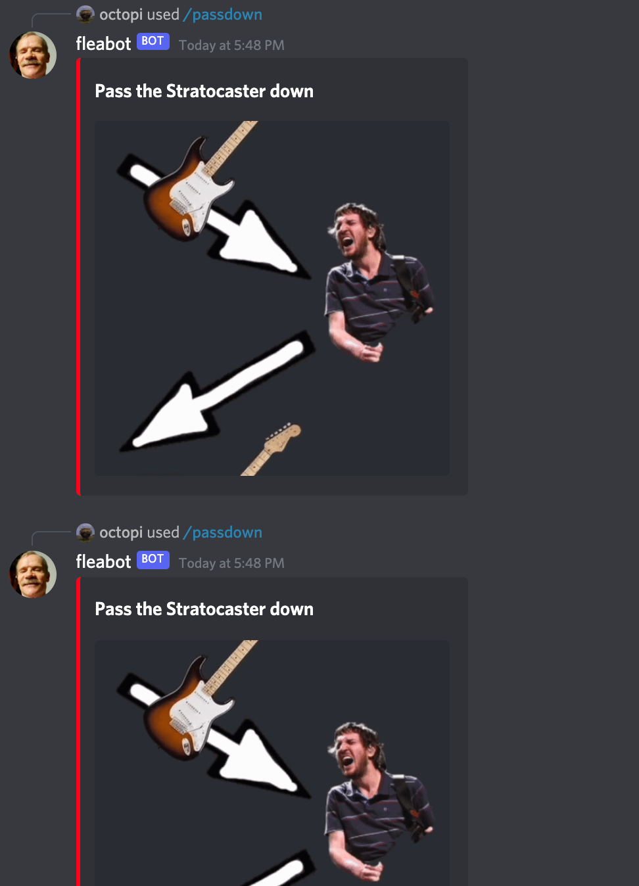

# FLEABOT

## A Discord bot with a collection of fun commands

A Discord bot with a collection of fun commands

# Features

TODO document other commands

## /passdown

- passes down a stratocaster.

# Installation | How to use the Bot

**1.** Install NodeJS

**2.** Download this repo and unzip it | or git clone it.

**3.** Open CMD and Install all the packages with **`npm install`**

**4.** Make sure you put down the credentials **`clientId`**, **`guildId`** and the **`token`**, along with twitter keys and channel ID's keys in a **`config.json`** file. More info [here](https://discordjs.guide/creating-your-bot/#creating-configuration-files).

**5.** Add the bot in Discord Developer dashboard.

**6.** start the bot with **`node fleabot.js`**
